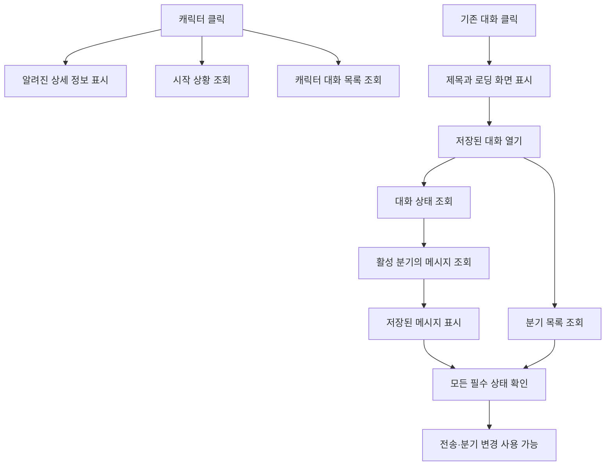

# LorePia UX 응답성 개선과 토스 디자인 원칙

LorePia의 주요 개선 지점은 이미 있는 콘텐츠를 보기까지 기다리는 시간, 진행 중인 작업을
알 수 없는 상태, 현재 화면과 관계없는 반복 계산이었다. 캐릭터 상세와 대화 화면은
먼저 열고, 독립적인 조회는 뒤에서 진행하도록 바꿨다. 대화 내용은 분기 목록보다 먼저
표시하며, 로딩·전송·응답 생성을 구분한다. 설정 편집기는 진입할 때 불러오고,
스트리밍 중에는 저장된 메시지의 화면 객체와 스크롤 인덱스를 재사용한다.

적용 브랜치는 `codex/ux-responsiveness-20260912`다. 기준 코드는
`aac3b16e0697c710b1209f498caba71821746140`과 진행 중이던 채팅방 화면 변경분이다.
기존 변경을 포함한 별도 작업 디렉터리에서 수정했다. 작업 범위와 불변 조건은
[구현 기록](ux-responsiveness-task.md)에 있다.

## 토스 원칙에서 채택한 기준

아래의 **공식 근거**는 토스가 공개한 글의 내용이고, **LorePia 적용**은 이 프로젝트의
코드와 화면에 대한 판단이다. 자료 대부분은 2022–2025년에 발표된 사례다. 당시 공개한
철학과 실험을 설명하는 자료이며, 토스의 현재 내부 원칙 전체를 대변한다고 보지는 않는다.
앱인토스 가이드의 플랫폼 전용 규정과 일반적인 사용성 원칙도 구분한다.

### 1. 먼저 사용자가 얻을 것을 보여준다

**공식 근거.** 토스의 Value first, Cost later는 사용자에게 수고를 요구하기 전에 얻을
가치를 구체적으로 전달하자는 원칙이다. 보험 조회 사례는 외부 기관 때문에 인증 절차를
줄이기 어려운 상황에서 결과의 효용을 먼저 보여주는 방식으로 개선했다. 원문은 해당
실험에서 조회 완료 비율이 기존보다 67% 높아졌다고 보고한다. 이 수치는 LorePia의
개선율이나 보편적인 UX 효과로 환산할 수 없다.[^1]

**LorePia 적용.** 캐릭터 이름·이미지·설명은 이미 목록에 존재한다. 시작 상황과 대화
목록 조회가 끝나지 않았다는 이유로 상세 화면 진입을 미룰 필요가 없다. 화면을 먼저
열면 사용자는 캐릭터를 읽는 동안 나머지 정보가 준비되는 경험을 얻는다. 이때 표시하는
것은 실제로 확보한 데이터다. 저장되지 않은 대화를 저장된 것처럼 보여주지는 않는다.

**구현상 의미.** 이 원칙 자체가 비동기 스케줄러나 낙관적 업데이트를 지시하는 것은
아니다. 여기서는 ‘확보한 가시적 정보를 먼저 제공한다’는 방식으로 해석했다. 저장 성공,
권한 승인, 생성 요청의 내구성 확보 같은 사실은 기존 소유자가 확인해야 한다.

### 2. 질문 수보다 대답하는 비용을 줄인다

**공식 근거.** Easy to answer 사례는 보험 청구 방법을 추상적으로 고르게 하던 흐름을
서류 준비 여부처럼 바로 답할 수 있는 질문으로 바꿨다. 연결된 보험 정보가 있으면
전체 보험사 대신 관련 목록을 제시했다. 정보를 입력하다 뒤늦게 선행 조건을 발견하는
문제를 앞단에서 다루는 접근이다.[^2]

**LorePia 적용.** 기존 새 대화 화면의 이름·페르소나·시작 상황·대화 모드는 하나의
‘대화 시작’ 작업에 속한다. 네 개의 입력을 무조건 네 화면으로 나누지 않았다. 반면
준비되지 않은 분기에 입력을 허용하거나, 로딩 중에 실제로 할 수 없는 ‘응답 중지’를
제시하는 것은 선택을 더 어렵게 만든다. 입력 가능 여부와 실행 중인 행동을 일치시켰다.

### 3. 한 화면의 중심 행동과 실제 입력 위치를 지킨다

**공식 근거.** 토스 가입 화면 개선에서는 추가 입력란 때문에 CTA가 키보드 아래로
밀리고, 새 필드가 생긴 사실을 알아채기 어려웠다. 입력을 여러 페이지로 나누는 안도
검토했지만 버튼을 반복해서 누르는 비용이 있었다. 최종 사례는 사용자가 집중하는 입력
위치를 중심으로 흐름을 설계하고 실제 사용성 테스트로 확인한 것이다.[^3]

**LorePia 적용.** 전송을 누른 뒤 입력창 주변에 진행 상태를 보여준다. 설정 화면의
비동기 진입에도 제목과 복귀 동선을 먼저 제공한다. 모바일 크기에서 입력·전송·설정
버튼이 화면 안에 있는지 확인했다. 브라우저의 좁은 화면 검증과 실제 iOS/Android
소프트 키보드 검증은 서로 다른 증거이므로 후자는 완료로 표시하지 않는다.

### 4. 내부 기능 묶음보다 사용자 행동을 기준으로 나눈다

**공식 근거.** ‘내 문서함’ 개편 사례는 조직이 맡은 여러 사업을 한 제품으로 묶으면서
사용자가 원하는 행동과 정보 위계가 흐려진 문제를 다룬다. 문서라는 공통 속성보다
발급·납부·알림 수신이라는 사용자 행동을 기준으로 다시 구성했다. 원문에는
Simplicity, One thing per One page, Less Policy, Clear CTA가 함께 등장한다.[^4]

**LorePia 적용.** 설정 메뉴에 진입했다고 페르소나와 프롬프트·기억 편집 데이터를 모두
조회할 필요는 없다. 현재 선택한 설정 항목에 필요한 컨텍스트만 불러오도록 바꿨다.
기존 네 개의 루트 탭과 편집 도구의 기능은 유지하며, 감춰진 탭이 현재 대화 변경을
따라 불필요한 작업을 시작하지 않게 했다.

### 5. 누른 곳 가까이에 반응과 복구 방법을 둔다

**공식 근거.** 토스의 메뉴 컴포넌트 사례는 화면 위에서 누른 버튼과 아래에 등장하는
선택지 사이의 물리적 거리가 인지 비용을 만든다고 설명한다. 가까운 메뉴가 적합한
상황을 실제 제품에서 실험했다. 모든 바텀시트를 메뉴로 교체하라는 규칙은 아니다.[^5]

**LorePia 적용.** 대화 조회 실패는 해당 대화 안에서 다시 시도할 수 있다. 로딩 중인
본문에는 로딩 상태가, 전송 중인 입력 영역에는 전송 상태가 나타난다. 사용자가 다른
설정 화면까지 찾아가서 복구 방법을 알아내지 않아도 된다. 기존 긴 선택 목록과
편집 시트의 포커스·닫기 동작은 유지한다.

### 6. 짧고 명확한 말로 상태를 사실대로 전달한다

**공식 근거.** 토스의 라이팅 자료는 명확함, 간결함, 친근함, 존중, 공감을 핵심 가치로
제시한다. 여덟 원칙의 실무적인 방향은 다음 행동을 예상하게 하기, 불필요한 단어와
문장 덜기, 중요한 정보에 집중하기, 말로 해도 자연스럽게 쓰기, 행동을 강요하지 않기,
넓은 독자가 이해할 표현 고르기, 상황의 감정 고려하기로 정리할 수 있다.[^6]

**LorePia 적용.** 로딩 문구에는 읽고 있는 대상을 명시했다. ‘캐릭터를 불러오고 있어요’,
‘채팅 내역을 불러오고 있어요’, ‘메시지를 보내고 있어요’처럼 현재 행동을 알려준다.
확인되지 않은 진행률이나 예상 완료 시간은 만들지 않는다. 새 문구는 기존 번역
카탈로그 체계 안의 `ko-workspace.ts`에 모았다.

### 7. 오류는 다음 행동을 안내하고, 이미 얻은 결과는 보존한다

**공식 근거.** 토스의 오류 안내 원칙은 실패 사실만 전달하는 대신 사용자가 상황을
이해하고 다음 단계로 움직일 수 있게 돕는 데 초점을 둔다. 사전에 막을 수 있는 오류,
적절한 안내 형식, 쉬운 해결 방법, 사용자 관점의 언어를 함께 고려한다.[^7]

**LorePia 적용.** 메시지를 읽는 데 성공한 뒤 분기 목록 조회만 실패하면 저장된 대화를
계속 보여준다. ‘다시 시도’는 현재 대화 조회를 재시도한다. 전송 오류에서는 입력 초안을
지키고, 아직 유효하지 않은 분기 상태로 후속 변경을 실행하지 않는다. 네트워크나 저장소
오류의 원인이 확인되지 않았는데 특정 원인을 임의로 단정하는 문구는 추가하지 않았다.

### 8. 원칙을 재사용 가능한 구현으로 만든다

**공식 근거.** 토스의 라이팅 시스템 사례는 규칙 문서만으로는 일관된 적용이 어렵다는
문제에서 출발했다. 반복되는 오류를 템플릿화하고, 개발자·디자이너의 실제 작업 환경에서
찾고 적용할 수 있도록 구성했다.[^8]

**LorePia 적용.** 목록과 본문의 초기 로딩 표현을 `LoadingState`로 공유한다. 화면마다
별도의 임시 타이머나 무관한 로딩 문구를 만들지 않는다. 비동기 요청의 유효성은
컨트롤러의 epoch가, 화면의 로딩 표현은 컴포넌트가 담당하도록 기존 소유권을 따른다.

### 9. 첫 로드와 실행 중 반복 작업을 따로 줄인다

**공식 근거.** Simplicity 4 제작기는 실제 모바일 환경에서 발견한 느린 이미지·영상
로드를 개선한 사례다. 필요한 자산을 순서대로 준비하고 영상 중복 로드를 피했으며,
불필요한 렌더링과 Safari의 무거운 블러 효과도 점검했다. CPU 감속을 사용한 확인도
설명한다.[^9] 프론트엔드 모닥불 EP.9의 공개 본문 역시 초기 로딩과 런타임 최적화를
별도 주제로 안내한다. 해당 글의 본문은 영상 소개와 목차이므로, 확인하지 않은 영상
대화를 세부 구현 근거로 인용하지 않는다.[^10]

**LorePia 적용.** 첫 진입에는 설정 편집기 코드를 읽지 않는다. 실행 중에는 스트림
토큰마다 변하지 않은 모든 메시지를 다시 변환하거나 스크롤용 목록을 재생성하지
않는다. 이미지에는 이미 존재하는 가시성·우선순위·메모리 보존 큐를 재사용한다.
캐릭터 카드가 많아질 때 화면 밖 이미지 요청이 보이는 이미지와 경쟁하는 일을 줄인다.

### 10. 소요 시간과 실제 조작을 함께 본다

**공식 근거.** 테이블센터 개선 사례에는 검색에 10초 이상 걸리는데 로딩 안내도 없던
문제가 나온다. 팀은 작업 시간·흐름·오류·만족도 등을 구분하고 가장 큰 불편을 먼저
개선했다.[^11] 별도의 라이브 UT 사례는 출시된 제품을 사용자의 휴대폰에서 관찰하는
가치를 강조하며, 소수 관찰 결과를 모든 사용자에게 일반화하지 말 것을 설명한다.[^12]

**LorePia 적용.** 즉시 응답하는 데모만으로 판단하지 않도록 조회에 1,800ms를 더한
격리된 미리보기를 추가했다. 화면은 실제 `WorkspaceApp`을 사용한다. 클릭 후 다음
화면이 나타나는지, 그 사이 뒤로갈 수 있는지, 저장된 본문을 먼저 읽는지 확인한다.
이 결과를 실제 사용자 만족도 조사나 실기기 프레임 측정으로 표현하지 않는다.

### 11. 보이는 것과 이해되는 것을 구분한다

**공식 근거.** 토스의 시니어 사용성 연구는 눌러야 할 요소, 예시 이미지, 모션, 문구,
스크롤 구조가 의도와 다르게 이해될 수 있음을 보여준다. 모든 사람이 UI 관습을 같은
방식으로 해석한다고 가정하기 어렵다는 근거다.[^13]

**LorePia 적용.** 어두운 캐릭터 이미지 위에서 뒤로가기 아이콘이 거의 보이지 않는
문제를 직접 확인했다. 버튼에 테마에 맞는 불투명 배경과 전경색을 주어 이미지 밝기와
무관하게 구분되도록 했다. 스켈레톤에는 실제 메시지나 가짜 수치를 넣지 않는다.

### 12. 로딩 표현은 실제 대기에만 쓴다

**공식 근거.** TDS Skeleton 문서는 빈 화면 대신 콘텐츠 구조를 임시로 보여주는 용도를
설명한다.[^14] 앱인토스 UI/UX 가이드는 기다릴 필요가 없는 곳의 로딩 애니메이션이
상황을 오해하게 만들 수 있다고 안내한다.[^15]

**LorePia 적용.** 첫 조회의 로딩과 조회 완료 후의 빈 목록을 구분했다. 기존 데이터가
있는 재조회는 목록을 지우지 않는다. 스켈레톤을 보여주기 위해 실제 완료를 늦추는
최소 대기 시간은 두지 않았다. 토스의 React 컴포넌트나 앱인토스 전용 탭 규격을
LorePia에 도입한 것은 아니며, 기존 Svelte 구성과 디자인을 사용한다.

## 발견한 비효율과 수정 결과

P0는 잘못된 행동을 유도하거나 화면이 반응하지 않는 핵심 흐름, P1은 빈번한 대기·반복
작업, P2는 데이터량에 따라 커지는 부가 비용이다. 모든 행은 이번 브랜치에 반영했다.
‘경합 방어’로 표시한 행은 빠른 화면 전환을 도입하면서 함께 필요한 보강이다.

| ID | 우선순위 | 관찰·코드 근거 | 바뀐 동작 |
| --- | --- | --- | --- |
| U01 | P0 | 캐릭터 선택이 인사말·목록 조회 완료를 기다린 뒤 화면을 엶 | 알려진 캐릭터를 먼저 선택·표시하고 조회는 계속 진행 |
| U02 | P0 | 대화 진입이 캐릭터 메타데이터까지 기다림 | 선택한 대화의 제목과 로딩 화면을 즉시 표시 |
| U03 | P0 | 분기 목록과 대화 상태를 모두 기다린 후 본문 조회를 시작 | 상태로 활성 분기를 확인하면 바로 본문을 읽고 먼저 표시 |
| U04 | P0 | 조회 중 빈 목록·빈 대화처럼 보일 수 있음 | 초기 로딩, 정상적인 빈 상태, 오류를 구분 |
| U05 | P0 | 일반 busy 상태가 응답 중지 버튼과 연결됨 | 실제 생성의 중지 가능 여부와 조회·전송 busy를 분리 |
| U06 | P1 | 전송 승인 대기 동안 입력 부근에 명확한 진행 안내가 없음 | 전송 중 상태 안내와 중복 제출 방지, 조건부 초안 정리 |
| U07 | P0 | 경합 방어: 방 진입이 인사말 조회까지 무효화할 수 있음 | 캐릭터 조회와 대화 조회의 epoch를 분리 |
| U08 | P1 | 경합 방어: 늦은 목록이 방 열기·생성의 최신 영수증을 덮을 수 있음 | 같은 캐릭터에서 확인된 최신 행을 합치고 조회 실패에도 보존 |
| U09 | P1 | 연속 무효화가 전체 대화 목록 중복 조회를 유발 | 동시에 한 요청만 유지하고 필요하면 완료 뒤 한 번 더 조회 |
| U10 | P1 | 전체 bootstrap 완료를 기다려 초기 캐릭터 작업이 지연 | 라이브러리가 준비되면 초기 선택을 시작; 부가 초기화와 분리 |
| U11 | P1 | 설정 루트·숨겨진 탭에서도 페르소나와 편집 컨텍스트 조회 | 선택한 설정 섹션이 활성일 때 해당 컨텍스트만 조회 |
| U12 | P1 | 첫 화면 번들에 설정 편집기 포함 | 설정 진입 시 동적 로드, 로딩·실패·재시도·닫힘 처리 |
| U13 | P1 | 스트림 갱신이 캐릭터 목록 투영까지 다시 유발 | 목록 투영의 반응 의존성을 실제 변경 필드로 좁힘 |
| U14 | P1 | 토큰마다 저장 메시지 뷰와 스크롤용 배열을 다시 생성 | 저장된 뷰와 스크롤 입력 참조를 재사용하고 현재 응답만 갱신 |
| U15 | P2 | 분기 메뉴를 얻기 위해 전체 대화 메시지 투영까지 수행 | 분기 데이터에서 바로 메뉴 항목 생성 |
| U16 | P2 | 전체 대화마다 캐릭터 배열을 검색 | 캐릭터 ID→이름 Map으로 결합 |
| U17 | P1 | 정렬 비교마다 날짜 파싱, 빈 검색에도 긴 설명 정규화·중복 정렬 | 날짜는 항목당 한 번, 빈 검색에서는 불필요한 문자열 작업 생략 |
| U18 | P1 | 홈 카드가 모두 이미지 로딩 컴포넌트를 생성 | 화면 근처 썸네일부터 기존 큐로 로딩 |
| U19 | P1 | 분기 정보가 준비되는 중간 상태마다 런타임 프로필 조회 가능 | 대화와 활성 분기가 모두 확인된 컨텍스트로 조회 |
| U20 | P1 | 경합 방어: 다른 캐릭터로 이동해도 이전 본문 조회를 시작할 수 있음 | 앞선 상태 조회 후 epoch를 검사해 불필요한 후속 조회 생략 |
| U21 | P1 | 이미지 위 검은 뒤로가기 아이콘이 배경에 묻힘 | 테마 대비를 유지하는 버튼 배경과 전경색 적용 |

## 기다림을 나눈 방식

기존의 문제는 모든 비동기 작업 자체가 느리다는 데 있지 않았다. 현재 행동에 필요하지
않은 작업을 같은 완료 조건에 묶은 경우가 있었다. 다음 흐름은 독립적인 읽기를
진행하면서도 변경 작업의 권한은 기존 컨트롤러에 남긴다.



본문 조회 완료와 전송 가능은 서로 다른 사건이다. 분기 목록이 늦어도 읽을 수 있지만,
필수 상태가 실패하면 전송이나 분기 변경은 허용하지 않는다. 이 방식은 화면의 반응을
앞당기면서 유효하지 않은 대상으로 변경 명령을 보내는 문제를 피한다.

캐릭터 조회와 대화 조회의 수명도 다르다. 같은 캐릭터의 방을 여는 동안 인사말 정보는
계속 유효할 수 있으므로 별도 epoch로 관리한다. 다른 캐릭터를 고르거나 컨트롤러를
폐기하면 이전 결과는 적용하지 않는다. 뒤늦은 완료 콜백이 사용자를 떠난 화면으로
다시 보내는 동작도 허용하지 않는다.

전체 대화 목록은 자체 조회 결과를 소유한다. 현재 방의 데이터를 임의로 전역 목록에
덮어쓰는 대신 실제 변경 후 재조회한다. 조회 중 무효화가 30번 연속 발생하는 테스트는
진행 중인 요청 하나와 후속 조회 하나로 처리한다. 후속 조회 동안 다시 변경이 생기면
추가 갱신이 필요하므로 모든 상황에서 평생 두 번만 요청한다는 의미는 아니다.

## 실제 작업량에 대한 근거

| 항목 | 이전 | 현재 | 해석 |
| --- | --- | --- | --- |
| 첫 진입 JS | 998.47 kB, gzip 251.09 kB | 약 764.78 kB, gzip 202.34 kB | 같은 도구 버전의 설정 분리 전후 빌드; JS 약 23.4% 감소 |
| 설정 편집기 JS | 첫 진입 JS에 포함 | 별도 약 237.26 kB | 필요 시 로드; 전체 코드가 이만큼 사라진 것은 아님 |
| 5,000개 저장 메시지 + 100회 텍스트 갱신 | 매 갱신 저장 뷰·스크롤 배열 재생성 | 저장 뷰 객체와 스크롤 입력 참조 유지 | 객체 동일성 및 재스캔 여부 회귀 테스트 |
| 1,000개 목록의 날짜 정렬 | 비교 함수 안에서 반복 파싱 | 파싱 1,000회 | 이름 정렬은 날짜 파싱 0회 |
| 빈 검색어 | 설명 정규화와 별도 목록 정렬 가능 | 설명을 읽지 않고 이미 계산한 목록 사용 | 긴 설명을 가진 카드에서도 불필요한 비용 제거 |
| 조회 중 30회 목록 갱신 요청 | 독립 요청 중첩 가능 | 동시에 1개, 완료 후 1개 | 오래된 결과가 최종 상태로 남지 않도록 후속 갱신 |
| 설정 루트 진입 | 여러 섹션의 데이터 조회 | 페르소나·오케스트레이션 조회 없음 | 섹션 선택 시에만 관련 조회를 시작하는 테스트 |

번들 수치는 본 UX 작업 중 **설정 코드 분리 직전과 직후**의 비교다. 최초 기준 커밋과의
전체 차이를 뜻하지 않는다. `dist/index.html`의 초기 module script는 entry 하나이며
설정 chunk를 초기 preload하지 않는다. worker·Wasm은 기존 별도 로드 경로를 유지한다.
gzip은 전송량 비교치이며, 로컬 Tauri 앱에서 똑같은 비율의 시작 시간 단축을 보장하지
않는다. entry에는 여전히 큰 chunk 경고가 남는다.

스트림 최적화도 전체 처리가 상수 시간이 됐다는 의미는 아니다. 현재 응답을 붙이기 위한
참조 배열 복사와 일부 분기 표시 계산은 남는다. 이미 존재하는 transcript 가상화는
유지했고, 이번에는 가상화 전에 반복되던 전체 메시지 변환·스크롤 입력 재생성을 줄였다.
전역 무제한 캐시를 만들지 않고 Workspace별 한 묶음만 보관한다. 저장 목록 교체,
활성 메시지 변경, 방 전환은 캐시를 갱신한다.

## 화면에서 확인한 경로

같은 Workspace 화면에 고정된 메모리 client를 연결하고 독립 조회에 지연을 넣은 환경을
사용했다. 실제 계정·자격증명·프로바이더 결제 호출은 사용하지 않는다. 다음 결과는
브라우저 조작과 화면 관찰이며, 네이티브 실기기 테스트 결과와 구별한다.

| 경로 | 관찰 결과 |
| --- | --- |
| 홈 → 캐릭터 상세 | 1.8초 조회가 남아도 이름·이미지·설명과 복귀 버튼 표시 |
| 상세 진입 후 바로 복귀 | 백그라운드 완료가 상세 화면을 다시 열지 않음 |
| 채팅 목록 → 기존 대화 | 제목과 로딩 상태가 먼저 표시되고 비어 있는 대화로 오인시키지 않음 |
| 기존 대화 로딩 | 아직 보낼 수 없을 때 전송 비활성; 단순 조회에 응답 중지 표시 없음 |
| 검색 → ‘아리아’ → 상세 | 입력 결과가 좁혀지고 선택한 상세로 이동 |
| 상세 → 시작하기 → 새 대화 | 기본 선택값을 보여주고 생성 대기 상태 후 실제 시작 메시지 표시 |
| 새 대화 → 텍스트 입력 → 전송 | 입력 옆 전송 버튼이 나타나고 생성 중 상태로 전환; 격리된 fixture 결과 확인 |
| 설정 → AI → 연결 관리 → 복귀 | 같은 상위 화면을 유지하고 뒤로가기·포커스 복귀 확인 |
| 설정 → 페르소나 → 편집 → 취소 | 해당 섹션 데이터 표시, 편집 취소 후 이전 화면 복귀 |
| 설정 → 보조 프롬프트 → 편집 → 복귀 | 상세 데이터와 선택·저장 가능 상태 표시 |
| 설정 → 데이터 | 저장 개수·원본 범위·새로고침 표시 확인 |
| 390×844 상세 화면 | 가로 overflow 없음, 하단 시작 CTA 표시, 이미지 위 뒤로가기 대비 수정 확인 |
| 1280×720 대화 화면 | 로딩·본문·입력 영역의 배치 확인 |

브라우저의 데모 이미지 표현은 고정된 미리보기용 자산을 사용한다. 실제 native asset
조회의 우선순위·폐기·유지 동작은 기존 썸네일 및 자산 회귀 테스트가 담당한다.
잠긴 Mac에서는 네이티브 앱 조작이 불가능했으므로, iOS/Android 키보드와 실기기
프레임 시간, 대형 실제 데이터베이스, 외부 모델의 첫 토큰 시간은 측정하지 않았다.

## 검증 범위

- 프런트엔드 전체: **138개 파일, 758개 테스트 통과**. Lua timeout sandbox와 정규식
  worker 후속 회귀 검사도 통과했다.
- 새 회귀 테스트 14개: 조기 진입·초기화, 분기 지연·실패 후 본문 보존, 독립 메타데이터,
  늦은 목록 결과·실패의 최신 행 보존, 오래된 후속 읽기 차단, 조회 합치기, 설정 조회
  범위, 대량 메시지 객체 유지와 목록 정렬 작업량.
- `npm run check`: 포맷·i18n·ESLint·TypeScript·Svelte 검사 통과.
- `npm run build`: 성공. 기존 Wasmoon의 브라우저 모듈 외부화와 큰 entry 경고는 남는다.
- 저장소 검사 스크립트: Python 단위 테스트 **102개 통과**. IPC 생성물, 아키텍처·크기,
  i18n baseline, AI context budget, refactoring archive, workflow 보안 검사 통과.
- Rust 포맷 검사 통과. Rust 코드·Cargo·스키마·IPC 계약 변경은 없다. 이 작업에서는
  Rust 전체 clippy/test 및 GitHub의 교차 플랫폼 게이트를 실행한 것으로 간주하지 않는다.

기존 진행 작업의 테스트가 채팅방 설정의 이전 닫기 문구를 기대하던 부분은 현재 화면의
닫기 동작에 맞췄다. 동적 로드 진입 테스트는 실제 요소가 준비될 때까지 기다리게 했다.
몇 군데의 기존 preview 타입·린트 오류도 의미 변경 없이 수정했다. 아키텍처 제한을
늘리거나 과거 refactoring 기록을 갱신하지 않았다.

## 적용하지 않은 단축과 남은 검증 경계

**내구성 있는 작업의 순서는 유지한다.** 새 대화의 생성·페르소나 연결, 저장 영수증,
generation attempt 기록, nonce·resume·취소·복구는 기존 컨트롤러와 Rust/Core 소유다.
선택이 수락됐다는 사실과 저장·생성이 성공했다는 사실을 혼동하지 않는다. 새 대화
생성처럼 안전한 시작 상태 확보가 필요한 동안은 진행 피드백을 제공하며 기존 완료
조건을 유지한다.

**모든 조회를 무작정 나누지는 않는다.** 프롬프트·기억·플러그인 편집 데이터에는
상호 참조가 있다. 필요한 섹션에 들어간 뒤 컨트롤러가 일관된 컨텍스트를 만드는 과정은
유지했다. 런타임 프로필도 권한·분기 맥락이 준비된 뒤 읽으며, 빠르게 보이게 하려고
승인되지 않은 카드 기능을 미리 실행하지 않는다.

**가시성을 높이되 기존 모션을 일괄 제거하지 않는다.** 프로필 이미지, 스크롤 헤더,
탭 스와이프와 복귀 전환은 기존 UX 계약의 일부다. 직접 발견한 뒤로가기 대비만
수정했다. 별도 기기에서 병목이 입증되지 않은 블러나 애니메이션을 모두 없애는 방식은
사용하지 않았다.

**대용량의 다음 측정 지점은 남는다.** 전체 목록 IPC는 그대로이며 SQL 페이지네이션이나
새 DTO를 추가하지 않았다. 수만 개 캐릭터의 검색 문자열 정규화, 대형 카드의 디코드,
실제 모바일 WebView의 메모리 압박은 실제 데이터·기기에서 추가 측정해야 한다.
기존 가상화 및 자산 제한 위에 이번의 중복 작업 감소를 적용한 상태다.

**완료의 범위는 재현하고 수정한 항목이다.** 위의 21개 항목을 반영했지만 모든 기기와
데이터에서 어떠한 지연도 없다는 보장은 아니다. 특히 외부 모델의 응답 속도와 native
저장소 작업은 이번 renderer 변경의 성능 수치로 설명할 수 없다. 배포 전에는 실제
기기에서 큰 라이브러리·긴 대화·취소·재연결과 소프트 키보드 경로를 확인해야 한다.

## 재현 방법

저장소의 `.node-version`에 맞는 Node 24.18.1로 아래 명령을 실행한다.

```bash
npm run dev --prefix apps/lorepia -- --host 127.0.0.1 --port 5187
```

- `/qa-ux.html`: 지정된 조회에 각각 1,800ms 지연을 넣은 검증 화면.
- `/qa-ux.html?fast=1`: 같은 fixture에서 인위적 지연을 제거한 화면.
- `/preview.html`: 기존 디자인 미리보기.

지연 fixture는 `getProviderOverview`, `getCharacterGreetingCatalog`,
`getConversationState`, `listBranches`, `listBranchMessages`, `listConversations`만
늦춘다. 메서드 이름 로그로 요청 시작을 확인할 수 있으며 인수·대화 본문·자격증명은
기록하지 않는다. 이 진입점은 production `main.ts`에서 참조하지 않는다.

회귀 테스트의 주요 파일은 다음과 같다.

- `apps/lorepia/src/app/tests/app-controller.progressive-loading.test.ts`
- `apps/lorepia/src/app/workspace/WorkspaceResponsiveness.test.ts`
- `apps/lorepia/src/app/workspace/workspace-projection.test.ts`
- 기존 `WorkspaceNavigation`, `WorkspaceRootSwipe`, `WorkspaceSettings` 및 메시지·자산
  관련 테스트

## 출처

아래는 토스가 직접 발행한 자료 15개다. 확인 기준일은 2026-09-12다. 게시일이 없는
개발자 문서는 확인일을 기재했다. Skeleton과 앱인토스 가이드는 직접 열기 응답에
제약이 있어 검색에 수록된 공식 본문도 함께 확인했다. 해당 문서의 최신 API 계약을
도입하는 용도로 사용하지 않았다.

[^1]: 이혜인, 토스. [토스 디자인 원칙 Value first, Cost later](https://toss.tech/article/value-first-cost-later). 2023-03-16. 가치와 입력 비용, 보험 조회 실험.
[^2]: 김재현, 토스. [토스 디자인 원칙, Easy to answer](https://toss.tech/article/insurance-claim-process). 2022-12-14. 선행 조건과 대답하기 쉬운 질문.
[^3]: 정희연, 토스. [거꾸로 입력하는 가입 화면, 처음에 어떻게 떠올렸을까?](https://toss.tech/article/toss-signup-process). 2022-09-20. 입력 위치, CTA, 키보드와 단계의 비용.
[^4]: 이지윤, 토스. [크고 복잡한 제품, 과감하게 갈아엎기](https://toss.tech/article/mydoc). 2023-09-03. 사용자 행동에 따른 구조와 불필요한 정책.
[^5]: 이정현, 토스. [이런 것도 컴포넌트로 만들어도 될까?](https://toss.tech/article/tds-component-making). 2024-02-19. 물리적 거리와 메뉴 컴포넌트 실험.
[^6]: 김자유, 토스. [토스의 8가지 라이팅 원칙들](https://toss.tech/article/21022). 2022-11-15. 라이팅 핵심 가치와 적용 원칙.
[^7]: 김자유, 토스. [좋은 에러 메시지를 만드는 6가지 원칙](https://toss.tech/article/21021). 2022-09-21. 다음 행동과 오류 복구 비용.
[^8]: 김자유, 토스. [가이드라인을 시스템으로 만드는 법](https://toss.tech/article/introducing-toss-error-message-system). 2022-11-04. 오류 템플릿과 작업 환경 내 재사용.
[^9]: 박은식·이예서, 토스. [뒤에 개발자 있어요 — Simplicity 4 제작기 #2](https://toss.tech/article/simplicity4-frontend-engineering). 2025-05-27. 모바일 로드·렌더링 최적화 사례.
[^10]: 토스 프론트엔드 챕터. [프론트엔드 서비스 최적화? 토스에서는 ‘이렇게’ 합니다! — EP.9 모닥불](https://toss.tech/article/firesidechat_frontend_9). 2024-12-19. 공개 소개·목차만 근거로 사용.
[^11]: 한지유, 토스. [업무용 툴, 내 동료가 정말 만족했나요?](https://toss.tech/article/tablecenter). 2024-07-24. 검색 대기와 성과 측정 사례.
[^12]: 서소희, 토스. [토스 팀은 점심 시간에 사용자를 만난다](https://toss.tech/article/user-interview). 2024-12-02. 실제 제품의 사용성 관찰과 일반화의 한계.
[^13]: 박서현, 토스. [시니어 사용자가 어려워하는 UX 5가지](https://toss.tech/article/senior-usability-research). 2024-12-23. 조작 요소·예시·모션·문구·화면 구조의 해석.
[^14]: Toss Design System. [Skeleton — Mobile](https://tossmini-docs.toss.im/tds-mobile/components/skeleton/). 게시일 미표시, 2026-09-12 확인. 콘텐츠 구조를 나타내는 로딩 표현.
[^15]: 앱인토스 개발자센터. [UI/UX 가이드](https://developers-apps-in-toss.toss.im/design/consumer-ux-guide.html). 게시일 미표시, 2026-09-12 확인. 실제 대기와 로딩 표현, 라이팅, 가독성. 미니앱 전용 규정은 LorePia의 의무로 적용하지 않음.
